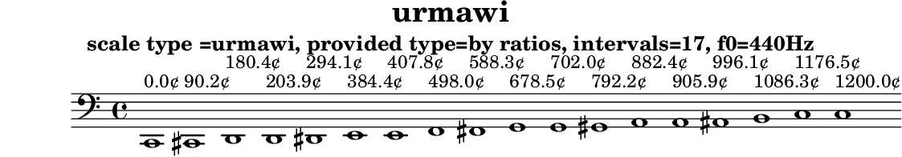

# urmawi

intervals of Safi al-Din al-Urmawi's enharmonic scale

Data source: [maqamat.yml](../../../maqamat.yml)

## Scale properties

- **Type**: ratios
- **Number of intervals**: 17
- **Intervals**: [1, 256/243, 65536/59049, 9/8, 32/27, 8192/6561, 81/64, 4/3, 1024/729, 262144/177147, 3/2, 128/81, 32768/19683, 27/16, 16/9, 4096/2187, 1048576/531441, 2]

## Source

- **Reference**: mikosch2022
- **Page**: 31

### Bibliography

> Mikosch, Thomas. *Oriental Jazz Improvisation - Microtonality and Harmony*. Tredition Gmbh, 2022.

## Derived data

```yaml
derived_ratios: [1, 256/243, 65536/59049, 9/8, 32/27, 8192/6561, 81/64, 4/3, 1024/729, 262144/177147, 3/2, 128/81, 32768/19683, 27/16, 16/9, 4096/2187, 1048576/531441, 2]
cents: [0.0, 90.22499567306306, 180.44999134612573, 203.91000173077484, 294.13499740383764, 384.35999307690065, 407.8200034615497, 498.0449991346125, 588.2699948076754, 678.4949904807384, 701.9550008653874, 792.1799965384502, 882.4049922115132, 905.8650025961623, 996.089998269225, 1086.314993942288, 1176.539989615351, 1200.0]
sha256: 7a5030161efb2cb31914f48f73eebfac41dcc830bda973228dca6f737a02c210
```

## Generated files

- [urmawi.tsv](urmawi.tsv)
- [urmawi.svg](urmawi.svg)
- [urmawi.scl](urmawi.scl)
- [urmawi.ly](urmawi.ly)
- [urmawi.cropped.png](urmawi.cropped.png)

## Interval table

```

#-------------------------------------------------------------------------------------------------
# scale type =urmawi, provided type=by ratios, intervals=17, f0=440Hz
#-------------------------------------------------------------------------------------------------
#          cents     Δ cents  f ratio   ratio (derived)  fl ratio    abs error    rel error       f (Hz)
#-------------------------------------------------------------------------------------------------
0       0.000000    0.000000  1.000000  1                1.000000   0.00000000   0.00000000 |   61.740 |   82.410 |  110.000 |  146.830 |  196.000 |  261.630 |  329.630 |  392.000 |  523.250
1      90.224996   90.224996  1.053498  256/243          1.053498   0.00000000   0.00000000 |   65.043 |   86.819 |  115.885 |  154.685 |  206.486 |  275.627 |  347.265 |  412.971 |  551.243
2     180.449991   90.224996  1.109858  65536/59049      1.109858   0.00000000   0.00000000 |   68.523 |   91.463 |  122.084 |  162.960 |  217.532 |  290.372 |  365.842 |  435.064 |  580.733
3     203.910002   23.460010  1.125000  9/8              1.125000   0.00000000   0.00000000 |   69.457 |   92.711 |  123.750 |  165.184 |  220.500 |  294.334 |  370.834 |  441.000 |  588.656
4     294.134997   90.224996  1.185185  32/27            1.185185   0.00000000   0.00000000 |   73.173 |   97.671 |  130.370 |  174.021 |  232.296 |  310.080 |  390.673 |  464.593 |  620.148
5     384.359993   90.224996  1.248590  8192/6561        1.248590   0.00000000   0.00000000 |   77.088 |  102.896 |  137.345 |  183.330 |  244.724 |  326.669 |  411.573 |  489.447 |  653.325
6     407.820003   23.460010  1.265625  81/64            1.265625   0.00000000   0.00000000 |   78.140 |  104.300 |  139.219 |  185.832 |  248.062 |  331.125 |  417.188 |  496.125 |  662.238
7     498.044999   90.224996  1.333333  4/3              1.333333   0.00000000   0.00000000 |   82.320 |  109.880 |  146.667 |  195.773 |  261.333 |  348.840 |  439.507 |  522.667 |  697.667
8     588.269995   90.224996  1.404664  1024/729         1.404664   0.00000000   0.00000000 |   86.724 |  115.758 |  154.513 |  206.247 |  275.314 |  367.502 |  463.019 |  550.628 |  734.990
9     678.494990   90.224996  1.479811  262144/177147    1.479811   0.00000000   0.00000000 |   91.364 |  121.951 |  162.779 |  217.281 |  290.043 |  387.163 |  487.790 |  580.086 |  774.311
10    701.955001   23.460010  1.500000  3/2              1.500000   0.00000000   0.00000000 |   92.610 |  123.615 |  165.000 |  220.245 |  294.000 |  392.445 |  494.445 |  588.000 |  784.875
11    792.179997   90.224996  1.580247  128/81           1.580247  -0.00000000  -0.00000000 |   97.564 |  130.228 |  173.827 |  232.028 |  309.728 |  413.440 |  520.897 |  619.457 |  826.864
12    882.404992   90.224996  1.664787  32768/19683      1.664787   0.00000000   0.00000000 |  102.784 |  137.195 |  183.127 |  244.441 |  326.298 |  435.558 |  548.764 |  652.596 |  871.100
13    905.865003   23.460010  1.687500  27/16            1.687500   0.00000000   0.00000000 |  104.186 |  139.067 |  185.625 |  247.776 |  330.750 |  441.501 |  556.251 |  661.500 |  882.984
14    996.089998   90.224996  1.777778  16/9             1.777778   0.00000000   0.00000000 |  109.760 |  146.507 |  195.556 |  261.031 |  348.444 |  465.120 |  586.009 |  696.889 |  930.222
15   1086.314994   90.224996  1.872885  4096/2187        1.872885   0.00000000   0.00000000 |  115.632 |  154.344 |  206.017 |  274.996 |  367.086 |  490.003 |  617.359 |  734.171 |  979.987
16   1176.539990   90.224996  1.973081  1048576/531441   1.973081   0.00000000   0.00000000 |  121.818 |  162.602 |  217.039 |  289.707 |  386.724 |  516.217 |  650.387 |  773.448 | 1032.414
17   1200.000000   23.460010  2.000000  2                2.000000   0.00000000   0.00000000 |  123.480 |  164.820 |  220.000 |  293.660 |  392.000 |  523.260 |  659.260 |  784.000 | 1046.500
#-------------------------------------------------------------------------------------------------
# Scala file written: results/ratios/urmawi/urmawi.scl
# derived ratios: [1, 256/243, 65536/59049, 9/8, 32/27, 8192/6561, 81/64, 4/3, 1024/729, 262144/177147, 3/2, 128/81, 32768/19683, 27/16, 16/9, 4096/2187, 1048576/531441, 2]
# derived  cents: [0.0, 90.22499567306306, 180.44999134612573, 203.91000173077484, 294.13499740383764, 384.35999307690065, 407.8200034615497, 498.0449991346125, 588.2699948076754, 678.4949904807384, 701.9550008653874, 792.1799965384502, 882.4049922115132, 905.8650025961623, 996.089998269225, 1086.314993942288, 1176.539989615351, 1200.0]
# derived  cents: sha256:7a5030161efb2cb31914f48f73eebfac41dcc830bda973228dca6f737a02c210
#-------------------------------------------------------------------------------------------------
```

## Scala tuning file

```
! results/ratios/urmawi/urmawi.scl
!
scale type =urmawi, provided type=by ratios, intervals=17, f0=440Hz
 17
!
 90.224996
 180.449991
 203.910002
 294.134997
 384.359993
 407.820003
 498.044999
 588.269995
 678.494990
 701.955001
 792.179997
 882.404992
 905.865003
 996.089998
 1086.314994
 1176.539990
 1200.000000
```

## LilyPond file



```lilypond
\version "2.24.0"

\header {
  title = "urmawi"
  subtitle = "scale type =urmawi, provided type=by ratios, intervals=17, f0=440Hz"
  tagline = ##f
}

\score {
  \new Staff {
    \clef "bass"
    \cadenzaOn
    \absolute {
      c,1^\markup { "0.0¢" }
      cis,1^\markup { "90.2¢" }
      d,1^\markup { "180.4¢" }
      d,1^\markup { "203.9¢" }
      dis,1^\markup { "294.1¢" }
      e,1^\markup { "384.4¢" }
      e,1^\markup { "407.8¢" }
      f,1^\markup { "498.0¢" }
      fis,1^\markup { "588.3¢" }
      g,1^\markup { "678.5¢" }
      g,1^\markup { "702.0¢" }
      gis,1^\markup { "792.2¢" }
      a,1^\markup { "882.4¢" }
      a,1^\markup { "905.9¢" }
      ais,1^\markup { "996.1¢" }
      b,1^\markup { "1086.3¢" }
      c1^\markup { "1176.5¢" }
      c1^\markup { "1200.0¢" }
    }
  }
  \layout { }
}
```
