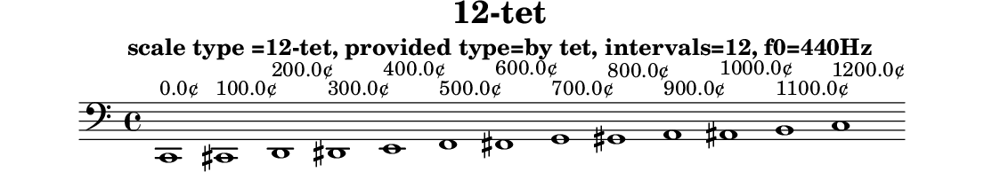

# 12-tet

N-tone equal temperament

Data source: [maqamat.yml](../../../maqamat.yml)

## Scale properties

- **Type**: tet
- **Number of intervals**: 12
- **Equal divisions of the octave**: 12

## Derived data

```yaml
derived_ratios: [1, 12/11, 9/8, 13/11, 5/4, 4/3, 7/5, 3/2, 8/5, 5/3, 16/9, 17/9, 2]
cents: [0.0, 100.0, 200.0, 300.0, 400.0, 500.0, 600.0, 700.0, 800.0, 900.0, 1000.0, 1100.0, 1200.0]
sha256: 33ae34b3f3a5dbefbfb34f77e704603b133757cbed06fb463aee133f9a947ce5
```

## Generated files

- [12-tet.tsv](12-tet.tsv)
- [12-tet.svg](12-tet.svg)
- [12-tet.scl](12-tet.scl)
- [12-tet.ly](12-tet.ly)
- [12-tet.cropped.png](12-tet.cropped.png)

## Interval table

```

#-------------------------------------------------------------------------------------------------
# scale type =12-tet, provided type=by tet, intervals=12, f0=440Hz
#-------------------------------------------------------------------------------------------------
#          cents     Δ cents  f ratio   ratio (derived)  fl ratio    abs error    rel error       f (Hz)
#-------------------------------------------------------------------------------------------------
0       0.000000    0.000000  1.000000  1                1.000000   0.00000000   0.00000000 |   61.740 |   82.410 |  110.000 |  146.830 |  196.000 |  261.630 |  329.630 |  392.000 |  523.250
1     100.000000  100.000000  1.059463  12/11            1.090909  -0.03144600  -2.96810684 |   65.411 |   87.310 |  116.541 |  155.561 |  207.655 |  277.187 |  349.231 |  415.310 |  554.364
2     200.000000  100.000000  1.122462  9/8              1.125000  -0.00253795  -0.22610579 |   69.301 |   92.502 |  123.471 |  164.811 |  220.003 |  293.670 |  369.997 |  440.005 |  587.328
3     300.000000  100.000000  1.189207  13/11            1.181818   0.00738893   0.62133274 |   73.422 |   98.003 |  130.813 |  174.611 |  233.085 |  311.132 |  391.998 |  466.169 |  622.253
4     400.000000  100.000000  1.259921  5/4              1.250000   0.00992105   0.78743425 |   77.788 |  103.830 |  138.591 |  184.994 |  246.945 |  329.633 |  415.308 |  493.889 |  659.254
5     500.000000  100.000000  1.334840  4/3              1.333333   0.00150652   0.11286154 |   82.413 |  110.004 |  146.832 |  195.995 |  261.629 |  349.234 |  440.003 |  523.257 |  698.455
6     600.000000  100.000000  1.414214  7/5              1.400000   0.01421356   1.00505063 |   87.314 |  116.545 |  155.563 |  207.649 |  277.186 |  370.001 |  466.167 |  554.372 |  739.987
7     700.000000  100.000000  1.498307  3/2              1.500000  -0.00169292  -0.11298906 |   92.505 |  123.475 |  164.814 |  219.996 |  293.668 |  392.002 |  493.887 |  587.336 |  783.989
8     800.000000  100.000000  1.587401  8/5              1.600000  -0.01259895  -0.79368399 |   98.006 |  130.818 |  174.614 |  233.078 |  311.131 |  415.312 |  523.255 |  622.261 |  830.608
9     900.000000  100.000000  1.681793  5/3              1.666667   0.01512616   0.89940708 |  103.834 |  138.597 |  184.997 |  246.938 |  329.631 |  440.007 |  554.369 |  659.263 |  879.998
10   1000.000000  100.000000  1.781797  16/9             1.777778   0.00401966   0.22559571 |  110.008 |  146.838 |  195.998 |  261.621 |  349.232 |  466.172 |  587.334 |  698.465 |  932.326
11   1100.000000  100.000000  1.887749  17/9             1.888889  -0.00114026  -0.06040336 |  116.550 |  155.569 |  207.652 |  277.178 |  369.999 |  493.892 |  622.259 |  739.997 |  987.764
12   1200.000000  100.000000  2.000000  2                2.000000   0.00000000   0.00000000 |  123.480 |  164.820 |  220.000 |  293.660 |  392.000 |  523.260 |  659.260 |  784.000 | 1046.500
#-------------------------------------------------------------------------------------------------
# Scala file written: results/tet/12-tet/12-tet.scl
# derived ratios: [1, 12/11, 9/8, 13/11, 5/4, 4/3, 7/5, 3/2, 8/5, 5/3, 16/9, 17/9, 2]
# derived  cents: [0.0, 100.0, 200.0, 300.0, 400.0, 500.0, 600.0, 700.0, 800.0, 900.0, 1000.0, 1100.0, 1200.0]
# derived  cents: sha256:33ae34b3f3a5dbefbfb34f77e704603b133757cbed06fb463aee133f9a947ce5
#-------------------------------------------------------------------------------------------------
```

## Scala tuning file

```
! results/tet/12-tet/12-tet.scl
!
scale type =12-tet, provided type=by tet, intervals=12, f0=440Hz
 12
!
 100.000000
 200.000000
 300.000000
 400.000000
 500.000000
 600.000000
 700.000000
 800.000000
 900.000000
 1000.000000
 1100.000000
 1200.000000
```

## LilyPond file



```lilypond
\version "2.24.0"

\header {
  title = "12-tet"
  subtitle = "scale type =12-tet, provided type=by tet, intervals=12, f0=440Hz"
  tagline = ##f
}

\score {
  \new Staff {
    \clef "bass"
    \cadenzaOn
    \absolute {
      c,1^\markup { "0.0¢" }
      cis,1^\markup { "100.0¢" }
      d,1^\markup { "200.0¢" }
      dis,1^\markup { "300.0¢" }
      e,1^\markup { "400.0¢" }
      f,1^\markup { "500.0¢" }
      fis,1^\markup { "600.0¢" }
      g,1^\markup { "700.0¢" }
      gis,1^\markup { "800.0¢" }
      a,1^\markup { "900.0¢" }
      ais,1^\markup { "1000.0¢" }
      b,1^\markup { "1100.0¢" }
      c1^\markup { "1200.0¢" }
    }
  }
  \layout { }
}
```
