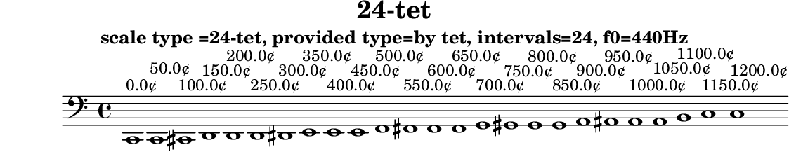

# 24-tet

N-tone equal temperament

Data source: [maqamat.yml](../../../maqamat.yml)

## Scale properties

- **Type**: tet
- **Number of intervals**: 24
- **Equal divisions of the octave**: 24

## Derived data

```yaml
derived_ratios: [1, 24/23, 18/17, 12/11, 9/8, 15/13, 25/21, 11/9, 29/23, 22/17, 4/3, 11/8, 24/17, 16/11, 3/2, 17/11, 27/17, 31/19, 37/22, 26/15, 41/23, 11/6, 17/9, 35/18, 2]
cents: [0.0, 50.0, 100.0, 150.0, 200.0, 250.0, 300.0, 350.0, 400.0, 450.0, 500.0, 550.0, 600.0, 650.0, 700.0, 750.0, 800.0, 850.0, 900.0, 950.0, 1000.0, 1050.0, 1100.0, 1150.0, 1200.0]
sha256: 8b8757708aa19ed5838f1084c0a6a5cff7bca945a5a6ce7daeec5a7aa15f36a9
```

## Generated files

- [24-tet.tsv](24-tet.tsv)
- [24-tet.svg](24-tet.svg)
- [24-tet.scl](24-tet.scl)
- [24-tet.ly](24-tet.ly)
- [24-tet.cropped.png](24-tet.cropped.png)

## Interval table

```

#-------------------------------------------------------------------------------------------------
# scale type =24-tet, provided type=by tet, intervals=24, f0=440Hz
#-------------------------------------------------------------------------------------------------
#          cents     Δ cents  f ratio   ratio (derived)  fl ratio    abs error    rel error       f (Hz)
#-------------------------------------------------------------------------------------------------
0       0.000000    0.000000  1.000000  1                1.000000   0.00000000   0.00000000 |   61.740 |   82.410 |  110.000 |  146.830 |  196.000 |  261.630 |  329.630 |  392.000 |  523.250
1      50.000000   50.000000  1.029302  24/23            1.043478  -0.01417602  -1.37724603 |   63.549 |   84.825 |  113.223 |  151.132 |  201.743 |  269.296 |  339.289 |  403.486 |  538.582
2     100.000000   50.000000  1.059463  18/17            1.058824   0.00063956   0.06036689 |   65.411 |   87.310 |  116.541 |  155.561 |  207.655 |  277.187 |  349.231 |  415.310 |  554.364
3     150.000000   50.000000  1.090508  12/11            1.090909  -0.00040136  -0.03680471 |   67.328 |   89.869 |  119.956 |  160.119 |  213.740 |  285.310 |  359.464 |  427.479 |  570.608
4     200.000000   50.000000  1.122462  9/8              1.125000  -0.00253795  -0.22610579 |   69.301 |   92.502 |  123.471 |  164.811 |  220.003 |  293.670 |  369.997 |  440.005 |  587.328
5     250.000000   50.000000  1.155353  15/13            1.153846   0.00150654   0.13039681 |   71.331 |   95.213 |  127.089 |  169.640 |  226.449 |  302.275 |  380.839 |  452.898 |  604.538
6     300.000000   50.000000  1.189207  25/21            1.190476  -0.00126908  -0.10671610 |   73.422 |   98.003 |  130.813 |  174.611 |  233.085 |  311.132 |  391.998 |  466.169 |  622.253
7     350.000000   50.000000  1.224054  11/9             1.222222   0.00183132   0.14961119 |   75.573 |  100.874 |  134.646 |  179.728 |  239.914 |  320.249 |  403.485 |  479.829 |  640.486
8     400.000000   50.000000  1.259921  29/23            1.260870  -0.00094852  -0.07528371 |   77.788 |  103.830 |  138.591 |  184.994 |  246.945 |  329.633 |  415.308 |  493.889 |  659.254
9     450.000000   50.000000  1.296840  22/17            1.294118   0.00272191   0.20988777 |   80.067 |  106.873 |  142.652 |  190.415 |  254.181 |  339.292 |  427.477 |  508.361 |  678.571
10    500.000000   50.000000  1.334840  4/3              1.333333   0.00150652   0.11286154 |   82.413 |  110.004 |  146.832 |  195.995 |  261.629 |  349.234 |  440.003 |  523.257 |  698.455
11    550.000000   50.000000  1.373954  11/8             1.375000  -0.00104635  -0.07615632 |   84.828 |  113.228 |  151.135 |  201.738 |  269.295 |  359.467 |  452.896 |  538.590 |  718.921
12    600.000000   50.000000  1.414214  24/17            1.411765   0.00244886   0.17316030 |   87.314 |  116.545 |  155.563 |  207.649 |  277.186 |  370.001 |  466.167 |  554.372 |  739.987
13    650.000000   50.000000  1.455653  16/11            1.454545   0.00110773   0.07609837 |   89.872 |  119.960 |  160.122 |  213.734 |  285.308 |  380.843 |  479.827 |  570.616 |  761.671
14    700.000000   50.000000  1.498307  3/2              1.500000  -0.00169292  -0.11298906 |   92.505 |  123.475 |  164.814 |  219.996 |  293.668 |  392.002 |  493.887 |  587.336 |  783.989
15    750.000000   50.000000  1.542211  17/11            1.545455  -0.00324372  -0.21032922 |   95.216 |  127.094 |  169.643 |  226.443 |  302.273 |  403.489 |  508.359 |  604.547 |  806.962
16    800.000000   50.000000  1.587401  27/17            1.588235  -0.00083424  -0.05255396 |   98.006 |  130.818 |  174.614 |  233.078 |  311.131 |  415.312 |  523.255 |  622.261 |  830.608
17    850.000000   50.000000  1.633915  31/19            1.631579   0.00233651   0.14300041 |  100.878 |  134.651 |  179.731 |  239.908 |  320.247 |  427.481 |  538.588 |  640.495 |  854.946
18    900.000000   50.000000  1.681793  37/22            1.681818  -0.00002535  -0.00150740 |  103.834 |  138.597 |  184.997 |  246.938 |  329.631 |  440.007 |  554.369 |  659.263 |  879.998
19    950.000000   50.000000  1.731073  26/15            1.733333  -0.00226021  -0.13056706 |  106.876 |  142.658 |  190.418 |  254.173 |  339.290 |  452.901 |  570.614 |  678.581 |  905.784
20   1000.000000   50.000000  1.781797  41/23            1.782609  -0.00081126  -0.04553039 |  110.008 |  146.838 |  195.998 |  261.621 |  349.232 |  466.172 |  587.334 |  698.465 |  932.326
21   1050.000000   50.000000  1.834008  11/6             1.833333   0.00067475   0.03679117 |  113.232 |  151.141 |  201.741 |  269.287 |  359.466 |  479.832 |  604.544 |  718.931 |  959.645
22   1100.000000   50.000000  1.887749  17/9             1.888889  -0.00114026  -0.06040336 |  116.550 |  155.569 |  207.652 |  277.178 |  369.999 |  493.892 |  622.259 |  739.997 |  987.764
23   1150.000000   50.000000  1.943064  35/18            1.944444  -0.00138056  -0.07105078 |  119.965 |  160.128 |  213.737 |  285.300 |  380.841 |  508.364 |  640.492 |  761.681 | 1016.708
24   1200.000000   50.000000  2.000000  2                2.000000   0.00000000   0.00000000 |  123.480 |  164.820 |  220.000 |  293.660 |  392.000 |  523.260 |  659.260 |  784.000 | 1046.500
#-------------------------------------------------------------------------------------------------
# Scala file written: results/tet/24-tet/24-tet.scl
# derived ratios: [1, 24/23, 18/17, 12/11, 9/8, 15/13, 25/21, 11/9, 29/23, 22/17, 4/3, 11/8, 24/17, 16/11, 3/2, 17/11, 27/17, 31/19, 37/22, 26/15, 41/23, 11/6, 17/9, 35/18, 2]
# derived  cents: [0.0, 50.0, 100.0, 150.0, 200.0, 250.0, 300.0, 350.0, 400.0, 450.0, 500.0, 550.0, 600.0, 650.0, 700.0, 750.0, 800.0, 850.0, 900.0, 950.0, 1000.0, 1050.0, 1100.0, 1150.0, 1200.0]
# derived  cents: sha256:8b8757708aa19ed5838f1084c0a6a5cff7bca945a5a6ce7daeec5a7aa15f36a9
#-------------------------------------------------------------------------------------------------
```

## Scala tuning file

```
! results/tet/24-tet/24-tet.scl
!
scale type =24-tet, provided type=by tet, intervals=24, f0=440Hz
 24
!
 50.000000
 100.000000
 150.000000
 200.000000
 250.000000
 300.000000
 350.000000
 400.000000
 450.000000
 500.000000
 550.000000
 600.000000
 650.000000
 700.000000
 750.000000
 800.000000
 850.000000
 900.000000
 950.000000
 1000.000000
 1050.000000
 1100.000000
 1150.000000
 1200.000000
```

## LilyPond file



```lilypond
\version "2.24.0"

\header {
  title = "24-tet"
  subtitle = "scale type =24-tet, provided type=by tet, intervals=24, f0=440Hz"
  tagline = ##f
}

\score {
  \new Staff {
    \clef "bass"
    \cadenzaOn
    \absolute {
      c,1^\markup { "0.0¢" }
      c,1^\markup { "50.0¢" }
      cis,1^\markup { "100.0¢" }
      d,1^\markup { "150.0¢" }
      d,1^\markup { "200.0¢" }
      d,1^\markup { "250.0¢" }
      dis,1^\markup { "300.0¢" }
      e,1^\markup { "350.0¢" }
      e,1^\markup { "400.0¢" }
      e,1^\markup { "450.0¢" }
      f,1^\markup { "500.0¢" }
      fis,1^\markup { "550.0¢" }
      fis,1^\markup { "600.0¢" }
      fis,1^\markup { "650.0¢" }
      g,1^\markup { "700.0¢" }
      gis,1^\markup { "750.0¢" }
      gis,1^\markup { "800.0¢" }
      gis,1^\markup { "850.0¢" }
      a,1^\markup { "900.0¢" }
      ais,1^\markup { "950.0¢" }
      ais,1^\markup { "1000.0¢" }
      ais,1^\markup { "1050.0¢" }
      b,1^\markup { "1100.0¢" }
      c1^\markup { "1150.0¢" }
      c1^\markup { "1200.0¢" }
    }
  }
  \layout { }
}
```
