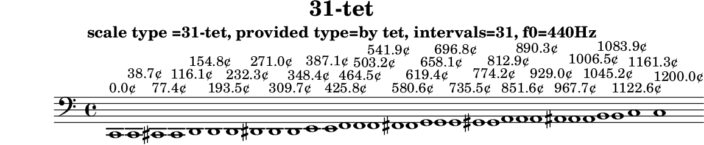

# 31-tet

N-tone equal temperament

Data source: [maqamat.yml](../../../maqamat.yml)

## Scale properties

- **Type**: tet
- **Number of intervals**: 31
- **Equal divisions of the octave**: 31

## Derived data

```yaml
derived_ratios: [1, 31/30, 23/22, 31/29, 23/21, 19/17, 8/7, 7/6, 31/26, 11/9, 5/4, 23/18, 17/13, 4/3, 26/19, 7/5, 10/7, 19/13, 3/2, 26/17, 36/23, 8/5, 18/11, 5/3, 41/24, 7/4, 34/19, 53/29, 43/23, 44/23, 45/23, 2]
cents: [0.0, 38.70967741935484, 77.41935483870968, 116.12903225806451, 154.83870967741936, 193.5483870967742, 232.25806451612902, 270.9677419354839, 309.6774193548387, 348.38709677419354, 387.0967741935484, 425.80645161290323, 464.51612903225805, 503.2258064516129, 541.9354838709678, 580.6451612903226, 619.3548387096774, 658.0645161290323, 696.7741935483871, 735.483870967742, 774.1935483870968, 812.9032258064516, 851.6129032258065, 890.3225806451613, 929.0322580645161, 967.741935483871, 1006.4516129032259, 1045.1612903225807, 1083.8709677419356, 1122.5806451612902, 1161.2903225806451, 1200.0]
sha256: 6be164e4f8d82d0d104ebad3af17ff792725a97fd03737779627f5ec1094d38e
```

## Generated files

- [31-tet.tsv](31-tet.tsv)
- [31-tet.svg](31-tet.svg)
- [31-tet.scl](31-tet.scl)
- [31-tet.ly](31-tet.ly)
- [31-tet.cropped.png](31-tet.cropped.png)

## Interval table

```

#-------------------------------------------------------------------------------------------------
# scale type =31-tet, provided type=by tet, intervals=31, f0=440Hz
#-------------------------------------------------------------------------------------------------
#          cents     Δ cents  f ratio   ratio (derived)  fl ratio    abs error    rel error       f (Hz)
#-------------------------------------------------------------------------------------------------
0       0.000000    0.000000  1.000000  1                1.000000   0.00000000   0.00000000 |   61.740 |   82.410 |  110.000 |  146.830 |  196.000 |  261.630 |  329.630 |  392.000 |  523.250
1      38.709677   38.709677  1.022611  31/30            1.033333  -0.01072190  -1.04848209 |   63.136 |   84.273 |  112.487 |  150.150 |  200.432 |  267.546 |  337.083 |  400.864 |  535.081
2      77.419355   38.709677  1.045734  23/22            1.045455   0.00027960   0.02673746 |   64.564 |   86.179 |  115.031 |  153.545 |  204.964 |  273.595 |  344.705 |  409.928 |  547.180
3     116.129032   38.709677  1.069380  31/29            1.068966   0.00041418   0.03873099 |   66.024 |   88.128 |  117.632 |  157.017 |  209.598 |  279.782 |  352.500 |  419.197 |  559.553
4     154.838710   38.709677  1.093560  23/21            1.095238  -0.00167819  -0.15346086 |   67.516 |   90.120 |  120.292 |  160.567 |  214.338 |  286.108 |  360.470 |  428.675 |  572.205
5     193.548387   38.709677  1.118287  19/17            1.117647   0.00063981   0.05721335 |   69.043 |   92.158 |  123.012 |  164.198 |  219.184 |  292.577 |  368.621 |  438.368 |  585.144
6     232.258065   38.709677  1.143573  8/7              1.142857   0.00071580   0.06259302 |   70.604 |   94.242 |  125.793 |  167.911 |  224.140 |  299.193 |  376.956 |  448.281 |  598.375
7     270.967742   38.709677  1.169431  7/6              1.166667   0.00276410   0.23636277 |   72.201 |   96.373 |  128.637 |  171.708 |  229.208 |  305.958 |  385.479 |  458.417 |  611.905
8     309.677419   38.709677  1.195873  31/26            1.192308   0.00356558   0.29815716 |   73.833 |   98.552 |  131.546 |  175.590 |  234.391 |  312.876 |  394.196 |  468.782 |  625.741
9     348.387097   38.709677  1.222914  11/9             1.222222   0.00069146   0.05654229 |   75.503 |  100.780 |  134.521 |  179.560 |  239.691 |  319.951 |  403.109 |  479.382 |  639.890
10    387.096774   38.709677  1.250566  5/4              1.250000   0.00056552   0.04522111 |   77.210 |  103.059 |  137.562 |  183.621 |  245.111 |  327.185 |  412.224 |  490.222 |  654.358
11    425.806452   38.709677  1.278843  23/18            1.277778   0.00106482   0.08326463 |   78.956 |  105.389 |  140.673 |  187.772 |  250.653 |  334.584 |  421.545 |  501.306 |  669.154
12    464.516129   38.709677  1.307759  17/13            1.307692   0.00006676   0.00510497 |   80.741 |  107.772 |  143.853 |  192.018 |  256.321 |  342.149 |  431.077 |  512.642 |  684.285
13    503.225806   38.709677  1.337329  4/3              1.333333   0.00399605   0.29880784 |   82.567 |  110.209 |  147.106 |  196.360 |  262.117 |  349.885 |  440.824 |  524.233 |  699.758
14    541.935484   38.709677  1.367568  26/19            1.368421  -0.00085274  -0.06235426 |   84.434 |  112.701 |  150.433 |  200.800 |  268.043 |  357.797 |  450.792 |  536.087 |  715.580
15    580.645161   38.709677  1.398491  7/5              1.400000  -0.00150900  -0.10790213 |   86.343 |  115.250 |  153.834 |  205.340 |  274.104 |  365.887 |  460.985 |  548.208 |  731.760
16    619.354839   38.709677  1.430113  10/7             1.428571   0.00154146   0.10778583 |   88.295 |  117.856 |  157.312 |  209.983 |  280.302 |  374.160 |  471.408 |  560.604 |  748.307
17    658.064516   38.709677  1.462450  19/13            1.461538   0.00091133   0.06231540 |   90.292 |  120.520 |  160.869 |  214.732 |  286.640 |  382.621 |  482.067 |  573.280 |  765.227
18    696.774194   38.709677  1.495518  3/2              1.500000  -0.00448212  -0.29970338 |   92.333 |  123.246 |  164.507 |  219.587 |  293.122 |  391.272 |  492.968 |  586.243 |  782.530
19    735.483871   38.709677  1.529334  26/17            1.529412  -0.00007808  -0.00510523 |   94.421 |  126.032 |  168.227 |  224.552 |  299.749 |  400.120 |  504.114 |  599.499 |  800.224
20    774.193548   38.709677  1.563914  36/23            1.565217  -0.00130327  -0.08333402 |   96.556 |  128.882 |  172.031 |  229.630 |  306.527 |  409.167 |  515.513 |  613.054 |  818.318
21    812.903226   38.709677  1.599276  8/5              1.600000  -0.00072354  -0.04524157 |   98.739 |  131.796 |  175.920 |  234.822 |  313.458 |  418.419 |  527.170 |  626.916 |  836.821
22    851.612903   38.709677  1.635438  18/11            1.636364  -0.00092524  -0.05657427 |  100.972 |  134.776 |  179.898 |  240.131 |  320.546 |  427.880 |  539.090 |  641.092 |  855.743
23    890.322581   38.709677  1.672418  5/3              1.666667   0.00575134   0.34389383 |  103.255 |  137.824 |  183.966 |  245.561 |  327.794 |  437.555 |  551.279 |  655.588 |  875.093
24    929.032258   38.709677  1.710234  41/24            1.708333   0.00190045   0.11112211 |  105.590 |  140.940 |  188.126 |  251.114 |  335.206 |  447.448 |  563.744 |  670.412 |  894.880
25    967.741935   38.709677  1.748905  7/4              1.750000  -0.00109538  -0.06263223 |  107.977 |  144.127 |  192.380 |  256.792 |  342.785 |  457.566 |  576.491 |  685.571 |  915.114
26   1006.451613   38.709677  1.788450  34/19            1.789474  -0.00102382  -0.05724610 |  110.419 |  147.386 |  196.729 |  262.598 |  350.536 |  467.912 |  589.527 |  701.072 |  935.806
27   1045.161290   38.709677  1.828889  53/29            1.827586   0.00130308   0.07124972 |  112.916 |  150.719 |  201.178 |  268.536 |  358.462 |  478.492 |  602.857 |  716.925 |  956.966
28   1083.870968   38.709677  1.870243  43/23            1.869565   0.00067788   0.03624557 |  115.469 |  154.127 |  205.727 |  274.608 |  366.568 |  489.312 |  616.488 |  733.135 |  978.605
29   1122.580645   38.709677  1.912532  44/23            1.913043  -0.00051150  -0.02674461 |  118.080 |  157.612 |  210.379 |  280.817 |  374.856 |  500.376 |  630.428 |  749.713 | 1000.732
30   1161.290323   38.709677  1.955777  45/23            1.956522  -0.00074467  -0.03807522 |  120.750 |  161.176 |  215.135 |  287.167 |  383.332 |  511.690 |  644.683 |  766.665 | 1023.360
31   1200.000000   38.709677  2.000000  2                2.000000   0.00000000   0.00000000 |  123.480 |  164.820 |  220.000 |  293.660 |  392.000 |  523.260 |  659.260 |  784.000 | 1046.500
#-------------------------------------------------------------------------------------------------
# Scala file written: results/tet/31-tet/31-tet.scl
# derived ratios: [1, 31/30, 23/22, 31/29, 23/21, 19/17, 8/7, 7/6, 31/26, 11/9, 5/4, 23/18, 17/13, 4/3, 26/19, 7/5, 10/7, 19/13, 3/2, 26/17, 36/23, 8/5, 18/11, 5/3, 41/24, 7/4, 34/19, 53/29, 43/23, 44/23, 45/23, 2]
# derived  cents: [0.0, 38.70967741935484, 77.41935483870968, 116.12903225806451, 154.83870967741936, 193.5483870967742, 232.25806451612902, 270.9677419354839, 309.6774193548387, 348.38709677419354, 387.0967741935484, 425.80645161290323, 464.51612903225805, 503.2258064516129, 541.9354838709678, 580.6451612903226, 619.3548387096774, 658.0645161290323, 696.7741935483871, 735.483870967742, 774.1935483870968, 812.9032258064516, 851.6129032258065, 890.3225806451613, 929.0322580645161, 967.741935483871, 1006.4516129032259, 1045.1612903225807, 1083.8709677419356, 1122.5806451612902, 1161.2903225806451, 1200.0]
# derived  cents: sha256:6be164e4f8d82d0d104ebad3af17ff792725a97fd03737779627f5ec1094d38e
#-------------------------------------------------------------------------------------------------
```

## Scala tuning file

```
! results/tet/31-tet/31-tet.scl
!
scale type =31-tet, provided type=by tet, intervals=31, f0=440Hz
 31
!
 38.709677
 77.419355
 116.129032
 154.838710
 193.548387
 232.258065
 270.967742
 309.677419
 348.387097
 387.096774
 425.806452
 464.516129
 503.225806
 541.935484
 580.645161
 619.354839
 658.064516
 696.774194
 735.483871
 774.193548
 812.903226
 851.612903
 890.322581
 929.032258
 967.741935
 1006.451613
 1045.161290
 1083.870968
 1122.580645
 1161.290323
 1200.000000
```

## LilyPond file



```lilypond
\version "2.24.0"

\header {
  title = "31-tet"
  subtitle = "scale type =31-tet, provided type=by tet, intervals=31, f0=440Hz"
  tagline = ##f
}

\score {
  \new Staff {
    \clef "bass"
    \cadenzaOn
    \absolute {
      c,1^\markup { "0.0¢" }
      c,1^\markup { "38.7¢" }
      cis,1^\markup { "77.4¢" }
      cis,1^\markup { "116.1¢" }
      d,1^\markup { "154.8¢" }
      d,1^\markup { "193.5¢" }
      d,1^\markup { "232.3¢" }
      dis,1^\markup { "271.0¢" }
      dis,1^\markup { "309.7¢" }
      dis,1^\markup { "348.4¢" }
      e,1^\markup { "387.1¢" }
      e,1^\markup { "425.8¢" }
      f,1^\markup { "464.5¢" }
      f,1^\markup { "503.2¢" }
      f,1^\markup { "541.9¢" }
      fis,1^\markup { "580.6¢" }
      fis,1^\markup { "619.4¢" }
      g,1^\markup { "658.1¢" }
      g,1^\markup { "696.8¢" }
      g,1^\markup { "735.5¢" }
      gis,1^\markup { "774.2¢" }
      gis,1^\markup { "812.9¢" }
      a,1^\markup { "851.6¢" }
      a,1^\markup { "890.3¢" }
      a,1^\markup { "929.0¢" }
      ais,1^\markup { "967.7¢" }
      ais,1^\markup { "1006.5¢" }
      ais,1^\markup { "1045.2¢" }
      b,1^\markup { "1083.9¢" }
      b,1^\markup { "1122.6¢" }
      c1^\markup { "1161.3¢" }
      c1^\markup { "1200.0¢" }
    }
  }
  \layout { }
}
```
