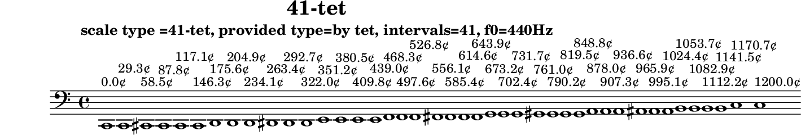

# 41-tet

N-tone equal temperament

Data source: [maqamat.yml](../../../maqamat.yml)

## Scale properties

- **Type**: tet
- **Number of intervals**: 41
- **Equal divisions of the octave**: 41

## Derived data

```yaml
derived_ratios: [1, 41/40, 30/29, 20/19, 31/29, 37/34, 31/28, 9/8, 8/7, 43/37, 45/38, 47/39, 49/40, 46/37, 19/15, 49/38, 38/29, 4/3, 42/31, 51/37, 7/5, 57/40, 29/20, 59/40, 3/2, 29/19, 45/29, 30/19, 61/38, 49/30, 63/38, 49/29, 67/39, 7/4, 16/9, 47/26, 68/37, 43/23, 19/10, 29/15, 59/30, 2]
cents: [0.0, 29.26829268292683, 58.53658536585366, 87.8048780487805, 117.07317073170732, 146.34146341463415, 175.609756097561, 204.8780487804878, 234.14634146341464, 263.4146341463415, 292.6829268292683, 321.9512195121951, 351.219512195122, 380.4878048780488, 409.7560975609756, 439.0243902439025, 468.2926829268293, 497.5609756097561, 526.829268292683, 556.0975609756098, 585.3658536585366, 614.6341463414634, 643.9024390243902, 673.1707317073171, 702.439024390244, 731.7073170731708, 760.9756097560976, 790.2439024390244, 819.5121951219512, 848.7804878048781, 878.048780487805, 907.3170731707318, 936.5853658536586, 965.8536585365854, 995.1219512195122, 1024.3902439024391, 1053.658536585366, 1082.9268292682927, 1112.1951219512196, 1141.4634146341464, 1170.7317073170732, 1200.0]
sha256: be59c63a57f1c0958c1d79de73c93a9cc75504849fd10d281560a275311f21ae
```

## Generated files

- [41-tet.tsv](41-tet.tsv)
- [41-tet.svg](41-tet.svg)
- [41-tet.scl](41-tet.scl)
- [41-tet.ly](41-tet.ly)
- [41-tet.cropped.png](41-tet.cropped.png)

## Interval table

```

#-------------------------------------------------------------------------------------------------
# scale type =41-tet, provided type=by tet, intervals=41, f0=440Hz
#-------------------------------------------------------------------------------------------------
#          cents     Δ cents  f ratio   ratio (derived)  fl ratio    abs error    rel error       f (Hz)
#-------------------------------------------------------------------------------------------------
0       0.000000    0.000000  1.000000  1                1.000000   0.00000000   0.00000000 |   61.740 |   82.410 |  110.000 |  146.830 |  196.000 |  261.630 |  329.630 |  392.000 |  523.250
1      29.268293   29.268293  1.017050  41/40            1.025000  -0.00795026  -0.78169781 |   62.793 |   83.815 |  111.875 |  149.333 |  199.342 |  266.091 |  335.250 |  398.683 |  532.171
2      58.536585   29.268293  1.034390  30/29            1.034483  -0.00009258  -0.00894981 |   63.863 |   85.244 |  113.783 |  151.880 |  202.740 |  270.628 |  340.966 |  405.481 |  541.245
3      87.804878   29.268293  1.052026  20/19            1.052632  -0.00060531  -0.05753735 |   64.952 |   86.697 |  115.723 |  154.469 |  206.197 |  275.242 |  346.779 |  412.394 |  550.473
4     117.073171   29.268293  1.069963  31/29            1.068966   0.00099753   0.09323058 |   66.060 |   88.176 |  117.696 |  157.103 |  209.713 |  279.934 |  352.692 |  419.426 |  559.858
5     146.341463   29.268293  1.088206  37/34            1.088235  -0.00002965  -0.00272444 |   67.186 |   89.679 |  119.703 |  159.781 |  213.288 |  284.707 |  358.705 |  426.577 |  569.404
6     175.609756   29.268293  1.106759  31/28            1.107143  -0.00038358  -0.03465816 |   68.331 |   91.208 |  121.744 |  162.505 |  216.925 |  289.561 |  364.821 |  433.850 |  579.112
7     204.878049   29.268293  1.125629  9/8              1.125000   0.00062924   0.05590096 |   69.496 |   92.763 |  123.819 |  165.276 |  220.623 |  294.498 |  371.041 |  441.247 |  588.985
8     234.146341   29.268293  1.144821  8/7              1.142857   0.00196379   0.17153648 |   70.681 |   94.345 |  125.930 |  168.094 |  224.385 |  299.519 |  377.367 |  448.770 |  599.028
9     263.414634   29.268293  1.164340  43/37            1.162162   0.00217767   0.18703049 |   71.886 |   95.953 |  128.077 |  170.960 |  228.211 |  304.626 |  383.801 |  456.421 |  609.241
10    292.682927   29.268293  1.184192  45/38            1.184211  -0.00001900  -0.00160422 |   73.112 |   97.589 |  130.261 |  173.875 |  232.102 |  309.820 |  390.345 |  464.203 |  619.628
11    321.951220   29.268293  1.204382  47/39            1.205128  -0.00074651  -0.06198309 |   74.359 |   99.253 |  132.482 |  176.839 |  236.059 |  315.102 |  397.000 |  472.118 |  630.193
12    351.219512   29.268293  1.224916  49/40            1.225000  -0.00008391  -0.00685008 |   75.626 |  100.945 |  134.741 |  179.854 |  240.084 |  320.475 |  403.769 |  480.167 |  640.937
13    380.487805   29.268293  1.245801  46/37            1.243243   0.00255736   0.20527806 |   76.916 |  102.666 |  137.038 |  182.921 |  244.177 |  325.939 |  410.653 |  488.354 |  651.865
14    409.756098   29.268293  1.267041  19/15            1.266667   0.00037451   0.02955814 |   78.227 |  104.417 |  139.375 |  186.040 |  248.340 |  331.496 |  417.655 |  496.680 |  662.979
15    439.024390   29.268293  1.288644  49/38            1.289474  -0.00082978  -0.06439137 |   79.561 |  106.197 |  141.751 |  189.212 |  252.574 |  337.148 |  424.776 |  505.148 |  674.283
16    468.292683   29.268293  1.310615  38/29            1.310345   0.00027013   0.02061097 |   80.917 |  108.008 |  144.168 |  192.438 |  256.881 |  342.896 |  432.018 |  513.761 |  685.779
17    497.560976   29.268293  1.332961  4/3              1.333333  -0.00037273  -0.02796220 |   82.297 |  109.849 |  146.626 |  195.719 |  261.260 |  348.742 |  439.384 |  522.521 |  697.472
18    526.829268   29.268293  1.355687  42/31            1.354839   0.00084854   0.06259085 |   83.700 |  111.722 |  149.126 |  199.056 |  265.715 |  354.688 |  446.875 |  531.429 |  709.363
19    556.097561   29.268293  1.378801  51/37            1.378378   0.00042299   0.03067799 |   85.127 |  113.627 |  151.668 |  202.449 |  270.245 |  360.736 |  454.494 |  540.490 |  721.458
20    585.365854   29.268293  1.402310  7/5              1.400000   0.00230958   0.16469815 |   86.579 |  115.564 |  154.254 |  205.901 |  274.853 |  366.886 |  462.243 |  549.705 |  733.758
21    614.634146   29.268293  1.426219  57/40            1.425000   0.00121860   0.08544257 |   88.055 |  117.535 |  156.884 |  209.412 |  279.539 |  373.142 |  470.124 |  559.078 |  746.269
22    643.902439   29.268293  1.450535  29/20            1.450000   0.00053526   0.03690089 |   89.556 |  119.539 |  159.559 |  212.982 |  284.305 |  379.504 |  478.140 |  568.610 |  758.993
23    673.170732   29.268293  1.475267  59/40            1.475000   0.00026652   0.01806562 |   91.083 |  121.577 |  162.279 |  216.613 |  289.152 |  385.974 |  486.292 |  578.304 |  771.933
24    702.439024   29.268293  1.500419  3/2              1.500000   0.00041943   0.02795439 |   92.636 |  123.650 |  165.046 |  220.307 |  294.082 |  392.555 |  494.583 |  588.164 |  785.094
25    731.707317   29.268293  1.526001  29/19            1.526316  -0.00031459  -0.02061522 |   94.215 |  125.758 |  167.860 |  224.063 |  299.096 |  399.248 |  503.016 |  598.192 |  798.480
26    760.975610   29.268293  1.552019  45/29            1.551724   0.00029499   0.01900708 |   95.822 |  127.902 |  170.722 |  227.883 |  304.196 |  406.055 |  511.592 |  608.391 |  812.094
27    790.243902   29.268293  1.578481  30/19            1.578947  -0.00046671  -0.02956688 |   97.455 |  130.083 |  173.633 |  231.768 |  309.382 |  412.978 |  520.315 |  618.764 |  825.940
28    819.512195   29.268293  1.605393  61/38            1.605263   0.00013019   0.00810985 |   99.117 |  132.300 |  176.593 |  235.720 |  314.657 |  420.019 |  529.186 |  629.314 |  840.022
29    848.780488   29.268293  1.632765  49/30            1.633333  -0.00056843  -0.03481420 |  100.807 |  134.556 |  179.604 |  239.739 |  320.022 |  427.180 |  538.208 |  640.044 |  854.344
30    878.048780   29.268293  1.660603  63/38            1.657895   0.00270839   0.16309657 |  102.526 |  136.850 |  182.666 |  243.826 |  325.478 |  434.464 |  547.385 |  650.956 |  868.911
31    907.317073   29.268293  1.688916  49/29            1.689655  -0.00073919  -0.04376713 |  104.274 |  139.184 |  185.781 |  247.984 |  331.028 |  441.871 |  556.717 |  662.055 |  883.725
32    936.585366   29.268293  1.717712  67/39            1.717949  -0.00023715  -0.01380614 |  106.052 |  141.557 |  188.948 |  252.212 |  336.671 |  449.405 |  566.209 |  673.343 |  898.793
33    965.853659   29.268293  1.746998  7/4              1.750000  -0.00300189  -0.17183123 |  107.860 |  143.970 |  192.170 |  256.512 |  342.412 |  457.067 |  575.863 |  684.823 |  914.117
34    995.121951   29.268293  1.776784  16/9             1.777778  -0.00099379  -0.05593223 |  109.699 |  146.425 |  195.446 |  260.885 |  348.250 |  464.860 |  585.681 |  696.499 |  929.702
35   1024.390244   29.268293  1.807078  47/26            1.807692  -0.00061461  -0.03401137 |  111.569 |  148.921 |  198.779 |  265.333 |  354.187 |  472.786 |  595.667 |  708.374 |  945.553
36   1053.658537   29.268293  1.837888  68/37            1.837838   0.00005007   0.00272437 |  113.471 |  151.460 |  202.168 |  269.857 |  360.226 |  480.847 |  605.823 |  720.452 |  961.675
37   1082.926829   29.268293  1.869223  43/23            1.869565  -0.00034179  -0.01828511 |  115.406 |  154.043 |  205.615 |  274.458 |  366.368 |  489.045 |  616.152 |  732.736 |  978.071
38   1112.195122   29.268293  1.901093  19/10            1.900000   0.00109321   0.05750426 |  117.373 |  156.669 |  209.120 |  279.138 |  372.614 |  497.383 |  626.657 |  745.229 |  994.747
39   1141.463415   29.268293  1.933506  29/15            1.933333   0.00017303   0.00894901 |  119.375 |  159.340 |  212.686 |  283.897 |  378.967 |  505.863 |  637.342 |  757.934 | 1011.707
40   1170.731707   29.268293  1.966472  59/30            1.966667  -0.00019451  -0.00989154 |  121.410 |  162.057 |  216.312 |  288.737 |  385.429 |  514.488 |  648.208 |  770.857 | 1028.957
41   1200.000000   29.268293  2.000000  2                2.000000   0.00000000   0.00000000 |  123.480 |  164.820 |  220.000 |  293.660 |  392.000 |  523.260 |  659.260 |  784.000 | 1046.500
#-------------------------------------------------------------------------------------------------
# Scala file written: results/tet/41-tet/41-tet.scl
# derived ratios: [1, 41/40, 30/29, 20/19, 31/29, 37/34, 31/28, 9/8, 8/7, 43/37, 45/38, 47/39, 49/40, 46/37, 19/15, 49/38, 38/29, 4/3, 42/31, 51/37, 7/5, 57/40, 29/20, 59/40, 3/2, 29/19, 45/29, 30/19, 61/38, 49/30, 63/38, 49/29, 67/39, 7/4, 16/9, 47/26, 68/37, 43/23, 19/10, 29/15, 59/30, 2]
# derived  cents: [0.0, 29.26829268292683, 58.53658536585366, 87.8048780487805, 117.07317073170732, 146.34146341463415, 175.609756097561, 204.8780487804878, 234.14634146341464, 263.4146341463415, 292.6829268292683, 321.9512195121951, 351.219512195122, 380.4878048780488, 409.7560975609756, 439.0243902439025, 468.2926829268293, 497.5609756097561, 526.829268292683, 556.0975609756098, 585.3658536585366, 614.6341463414634, 643.9024390243902, 673.1707317073171, 702.439024390244, 731.7073170731708, 760.9756097560976, 790.2439024390244, 819.5121951219512, 848.7804878048781, 878.048780487805, 907.3170731707318, 936.5853658536586, 965.8536585365854, 995.1219512195122, 1024.3902439024391, 1053.658536585366, 1082.9268292682927, 1112.1951219512196, 1141.4634146341464, 1170.7317073170732, 1200.0]
# derived  cents: sha256:be59c63a57f1c0958c1d79de73c93a9cc75504849fd10d281560a275311f21ae
#-------------------------------------------------------------------------------------------------
```

## Scala tuning file

```
! results/tet/41-tet/41-tet.scl
!
scale type =41-tet, provided type=by tet, intervals=41, f0=440Hz
 41
!
 29.268293
 58.536585
 87.804878
 117.073171
 146.341463
 175.609756
 204.878049
 234.146341
 263.414634
 292.682927
 321.951220
 351.219512
 380.487805
 409.756098
 439.024390
 468.292683
 497.560976
 526.829268
 556.097561
 585.365854
 614.634146
 643.902439
 673.170732
 702.439024
 731.707317
 760.975610
 790.243902
 819.512195
 848.780488
 878.048780
 907.317073
 936.585366
 965.853659
 995.121951
 1024.390244
 1053.658537
 1082.926829
 1112.195122
 1141.463415
 1170.731707
 1200.000000
```

## LilyPond file



```lilypond
\version "2.24.0"

\header {
  title = "41-tet"
  subtitle = "scale type =41-tet, provided type=by tet, intervals=41, f0=440Hz"
  tagline = ##f
}

\score {
  \new Staff {
    \clef "bass"
    \cadenzaOn
    \absolute {
      c,1^\markup { "0.0¢" }
      c,1^\markup { "29.3¢" }
      cis,1^\markup { "58.5¢" }
      cis,1^\markup { "87.8¢" }
      cis,1^\markup { "117.1¢" }
      cis,1^\markup { "146.3¢" }
      d,1^\markup { "175.6¢" }
      d,1^\markup { "204.9¢" }
      d,1^\markup { "234.1¢" }
      dis,1^\markup { "263.4¢" }
      dis,1^\markup { "292.7¢" }
      dis,1^\markup { "322.0¢" }
      e,1^\markup { "351.2¢" }
      e,1^\markup { "380.5¢" }
      e,1^\markup { "409.8¢" }
      e,1^\markup { "439.0¢" }
      f,1^\markup { "468.3¢" }
      f,1^\markup { "497.6¢" }
      f,1^\markup { "526.8¢" }
      fis,1^\markup { "556.1¢" }
      fis,1^\markup { "585.4¢" }
      fis,1^\markup { "614.6¢" }
      fis,1^\markup { "643.9¢" }
      g,1^\markup { "673.2¢" }
      g,1^\markup { "702.4¢" }
      g,1^\markup { "731.7¢" }
      gis,1^\markup { "761.0¢" }
      gis,1^\markup { "790.2¢" }
      gis,1^\markup { "819.5¢" }
      gis,1^\markup { "848.8¢" }
      a,1^\markup { "878.0¢" }
      a,1^\markup { "907.3¢" }
      a,1^\markup { "936.6¢" }
      ais,1^\markup { "965.9¢" }
      ais,1^\markup { "995.1¢" }
      ais,1^\markup { "1024.4¢" }
      b,1^\markup { "1053.7¢" }
      b,1^\markup { "1082.9¢" }
      b,1^\markup { "1112.2¢" }
      b,1^\markup { "1141.5¢" }
      c1^\markup { "1170.7¢" }
      c1^\markup { "1200.0¢" }
    }
  }
  \layout { }
}
```
