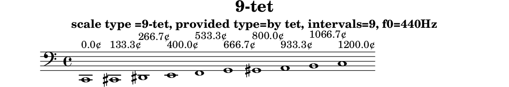

# 9-tet

N-tone equal temperament

Data source: [maqamat.yml](../../../maqamat.yml)

## Scale properties

- **Type**: tet
- **Number of intervals**: 9
- **Equal divisions of the octave**: 9

## Derived data

```yaml
derived_ratios: [1, 9/8, 7/6, 5/4, 11/8, 3/2, 8/5, 12/7, 13/7, 2]
cents: [0.0, 133.33333333333334, 266.6666666666667, 400.0, 533.3333333333334, 666.6666666666667, 800.0, 933.3333333333334, 1066.6666666666667, 1200.0]
sha256: a2d2609f32ebe82ac37ba2b232b5cde5a42992fbc6bd523195155244a8ff5acc
```

## Generated files

- [9-tet.tsv](9-tet.tsv)
- [9-tet.svg](9-tet.svg)
- [9-tet.scl](9-tet.scl)
- [9-tet.ly](9-tet.ly)
- [9-tet.cropped.png](9-tet.cropped.png)

## Interval table

```

#-------------------------------------------------------------------------------------------------
# scale type =9-tet, provided type=by tet, intervals=9, f0=440Hz
#-------------------------------------------------------------------------------------------------
#          cents     Δ cents  f ratio   ratio (derived)  fl ratio    abs error    rel error       f (Hz)
#-------------------------------------------------------------------------------------------------
0       0.000000    0.000000  1.000000  1                1.000000   0.00000000   0.00000000 |   61.740 |   82.410 |  110.000 |  146.830 |  196.000 |  261.630 |  329.630 |  392.000 |  523.250
1     133.333333  133.333333  1.080060  9/8              1.125000  -0.04494026  -4.16090513 |   66.683 |   89.008 |  118.807 |  158.585 |  211.692 |  282.576 |  356.020 |  423.383 |  565.141
2     266.666667  133.333333  1.166529  7/6              1.166667  -0.00013763  -0.01179800 |   72.022 |   96.134 |  128.318 |  171.281 |  228.640 |  305.199 |  384.523 |  457.279 |  610.386
3     400.000000  133.333333  1.259921  5/4              1.250000   0.00992105   0.78743425 |   77.788 |  103.830 |  138.591 |  184.994 |  246.945 |  329.633 |  415.308 |  493.889 |  659.254
4     533.333333  133.333333  1.360790  11/8             1.375000  -0.01421000  -1.04424634 |   84.015 |  112.143 |  149.687 |  199.805 |  266.715 |  356.023 |  448.557 |  533.430 |  712.033
5     666.666667  133.333333  1.469734  3/2              1.500000  -0.03026551  -2.05925001 |   90.741 |  121.121 |  161.671 |  215.801 |  288.068 |  384.527 |  484.469 |  576.136 |  769.039
6     800.000000  133.333333  1.587401  8/5              1.600000  -0.01259895  -0.79368399 |   98.006 |  130.818 |  174.614 |  233.078 |  311.131 |  415.312 |  523.255 |  622.261 |  830.608
7     933.333333  133.333333  1.714488  12/7             1.714286   0.00020225   0.01179661 |  105.852 |  141.291 |  188.594 |  251.738 |  336.040 |  448.561 |  565.147 |  672.079 |  897.106
8    1066.666667  133.333333  1.851749  13/7             1.857143  -0.00539343  -0.29126147 |  114.327 |  152.603 |  203.692 |  271.892 |  362.943 |  484.473 |  610.392 |  725.886 |  968.928
9    1200.000000  133.333333  2.000000  2                2.000000   0.00000000   0.00000000 |  123.480 |  164.820 |  220.000 |  293.660 |  392.000 |  523.260 |  659.260 |  784.000 | 1046.500
#-------------------------------------------------------------------------------------------------
# Scala file written: results/tet/9-tet/9-tet.scl
# derived ratios: [1, 9/8, 7/6, 5/4, 11/8, 3/2, 8/5, 12/7, 13/7, 2]
# derived  cents: [0.0, 133.33333333333334, 266.6666666666667, 400.0, 533.3333333333334, 666.6666666666667, 800.0, 933.3333333333334, 1066.6666666666667, 1200.0]
# derived  cents: sha256:a2d2609f32ebe82ac37ba2b232b5cde5a42992fbc6bd523195155244a8ff5acc
#-------------------------------------------------------------------------------------------------
```

## Scala tuning file

```
! results/tet/9-tet/9-tet.scl
!
scale type =9-tet, provided type=by tet, intervals=9, f0=440Hz
 9
!
 133.333333
 266.666667
 400.000000
 533.333333
 666.666667
 800.000000
 933.333333
 1066.666667
 1200.000000
```

## LilyPond file



```lilypond
\version "2.24.0"

\header {
  title = "9-tet"
  subtitle = "scale type =9-tet, provided type=by tet, intervals=9, f0=440Hz"
  tagline = ##f
}

\score {
  \new Staff {
    \clef "bass"
    \cadenzaOn
    \absolute {
      c,1^\markup { "0.0¢" }
      cis,1^\markup { "133.3¢" }
      dis,1^\markup { "266.7¢" }
      e,1^\markup { "400.0¢" }
      f,1^\markup { "533.3¢" }
      g,1^\markup { "666.7¢" }
      gis,1^\markup { "800.0¢" }
      a,1^\markup { "933.3¢" }
      b,1^\markup { "1066.7¢" }
      c1^\markup { "1200.0¢" }
    }
  }
  \layout { }
}
```
